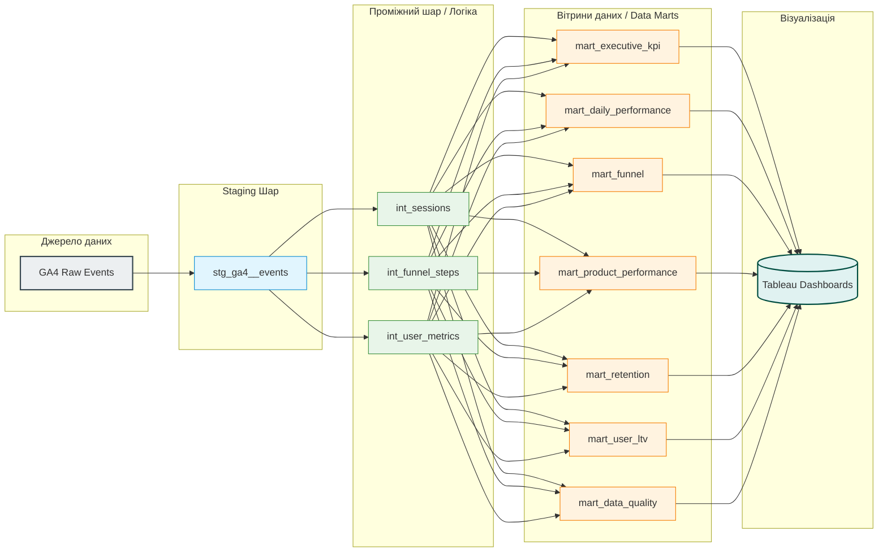

# GA4 Ecommerce Analytics Platform

End-to-end analytics engineering project built on Google Analytics 4 public e-commerce data:
BigQuery → dbt → Tableau → GitHub Actions

Dataset: bigquery-public-data.ga4_obfuscated_sample_ecommerce (Nov 2020 – Jan 2021, ~4.3M events)
Status: Production-style analytics pipeline with testing, data quality monitoring, source freshness validation and documented business marts.

## Project Overview

The goal of the project was to transform raw GA4 event data into trusted analytical datasets and reporting-ready business marts while applying modern analytics engineering practices:

* layered dbt architecture
* automated testing
* source freshness monitoring
* revenue reconciliation
* data quality monitoring
* business metric standardization

---

## Business Objectives

The project addresses common ecommerce analytics use cases:

* Marketing channel performance
* Executive KPI reporting
* Ecommerce funnel analysis
* Customer retention analysis
* Customer lifetime value analysis
* Product performance analysis
* Data quality monitoring
* Revenue reconciliation

---

## Tech Stack

* SQL
* dbt
* Google BigQuery
* Google Analytics 4 Sample Ecommerce Dataset
* Tableau Public
* GitHub
* GitHub Actions (CI/CD)

---

### Coverage Metrics

| Metric                    | Value   |
| ------------------------- | ------- |
| Raw events                | ~4.3M   |
| Sessions                  | ~408K   |
| Users                     | ~243K   |
| Purchase events           | 4,786   |
| Unique orders             | 4,466   |
| Revenue reconciled        | 308,830 |
| Revenue discrepancy fixed | 560     |
| Data marts                | 6       |
| Automated tests           | 20+     |

---

## Data Architecture

### Data Pipeline

### Staging Layer

Purpose: standardize raw GA4 export data and expose business-friendly fields.

Models:

* stg_ga4__events

Key transformations:

* event parameter extraction
* traffic attribution parsing
* ecommerce extraction
* device enrichment
* geography enrichment
* channel grouping
* data quality flags

Examples:

* missing transaction detection
* GDPR deleted traffic detection
* internal referral detection

---

### Intermediate Layer

Purpose: separate business logic from reporting logic.

Models:

* int_sessions
* int_user_metrics
* int_purchase_events_deduped

Responsibilities:

* session reconstruction
* user aggregation
* purchase deduplication

---

### Business Marts

The marts layer contains business-ready metrics designed for reporting and decision making.

#### mart_daily_performance

Marketing performance mart.

Dimensions:
* channel
* source
* medium
* country
* city
* device
* browser

Metrics:
* sessions
* users
* transactions
* revenue
* conversion rate
* AOV
  
#### mart_funnel

Normalized ecommerce funnel.

Steps:
* View Item
* Add To Cart
* Begin Checkout
* Purchase

Metrics:
* item_to_cart_rate
* cart_to_checkout_rate
* checkout_to_purchase_rate

#### mart_product_performance

Product performance analysis:

Metrics:
* product revenue
* units sold
* transaction count
* average item price

#### mart_retention

Customer retention metrics:

Metrics:
* cohort size
* active users
* retention rate

#### mart_user_ltv

Thin BI-facing layer built on top of int_user_metrics.

Purpose:
* expose user-level metrics for Tableau
* provide stable reporting interface
* avoid duplication of business logic

Metrics:
* total revenue
* total sessions
* active days
* purchase count
* average order value
* first-touch acquisition dimensions

#### mart_data_quality

Centralized data quality monitoring

Checks:
* missing transaction IDs
* duplicate transaction IDs
* revenue validation
* session anomalies
* data freshness checks

---

### Data Quality Deep Dive

One of the main goals of the project was ensuring metric consistency across all reporting layers.

During validation a revenue discrepancy was discovered.

#### Initial Finding

Revenue from session-level reporting did not match revenue from order-level reporting.

select round(sum(revenue),2)
from fct_orders

Result: 308,270

select round(sum(session_revenue),2)
from int_sessions

Result: 308,830

Difference: 560

#### Hypothesis 1

Duplicate purchase events.

Validation:
Purchase events: 4,786
Unique transactions: 4,451
Duplicates: 335

Deduplication implemented using:

row_number() over (
  partition by transaction_id
  order by event_timestamp
)

Partially reduced the discrepancy.

#### Hypothesis 2

Missing transaction IDs.

Validation:

906 purchase events

These events were excluded from financial reporting.

Discrepancy remained.

Hypothesis rejected.

#### Hypothesis 3

Session aggregation issue.

Validation:

No duplicated session_id values detected.

Hypothesis rejected.

#### Hypothesis 4

Transaction ID collisions.

Validation revealed that transaction_id was not globally unique.

Multiple users shared identical transaction IDs.

Example:

select
 transaction_id,
 count(distinct user_pseudo_id)
from int_purchase_events_deduped
group by 1
having count(distinct user_pseudo_id) > 1

Root cause confirmed.

#### Solution

A synthetic business key was introduced:

concat(
 user_pseudo_id,
 '-',
 transaction_id
) as order_key

All financial models were migrated to use:
order_key

instead of:
transaction_id

#### Result

Revenue reconciliation:

Session Revenue: 308,830
Order Revenue:   308,830
Difference:      0

Revenue fully reconciled.

### Data Quality Improvements

Additional improvements implemented:

#### Channel Attribution Fix

Investigation revealed that:

<Other>

traffic was incorrectly classified as:

Direct

because NULL source values and obfuscated GA4 values were treated identically.

Channel grouping logic was redesigned using raw source and medium values.

Result:
* Direct traffic corrected
* Obfuscated traffic isolated
* Channel reporting became more accurate

#### Testing

Automated dbt tests include:
* unique keys
* not null validation
* relationships tests
* funnel validation
* retention validation
* revenue validation
* LTV validation

All marts are validated through dbt test runs.

### Source Freshness Monitoring

The project includes dbt source freshness monitoring.

freshness:

  warn_after:
    count: 24
    period: hour

  error_after:
    count: 48
    period: hour

Purpose:

monitor source latency
detect stale data
simulate production-grade monitoring

Note:

The public GA4 sample dataset is static, therefore freshness checks are included to demonstrate implementation rather than operational alerting.

### CI/CD

CI/CD is implemented using GitHub Actions.

Every push and pull request automatically runs:
* dbt parse
* dbt build
* source freshness checks

This ensures that new changes do not break model dependencies or data quality validations.

### Documentation

dbt documentation includes:
* model descriptions
* column descriptions
* lineage graph
* business definitions
* test coverage

The lineage graph visualizes how raw GA4 events are transformed into reporting-ready analytical datasets.

### Key Skills Demonstrated
* Analytics Engineering
* SQL Development
* Data Modeling
* dbt
* BigQuery
* Data Quality Monitoring
* Revenue Reconciliation
* Funnel Analytics
* Cohort Analysis
* Customer Lifetime Value Analysis
* Marketing Attribution
* CI/CD
* Source Freshness Monitoring

### Repository Structure
models/
├── staging/
├── intermediate/
├── marts/
├── tests/
.github/
└── workflows/
